# Catoverse-Blog
Catoverse-Blog is designed for cat lovers. It helps understand cats behaviour and their needs better.
Users can share tips and experiences.

You can access live page to Catoverse-Blog by clicking [here](https://catoverse-blog.herokuapp.com/).

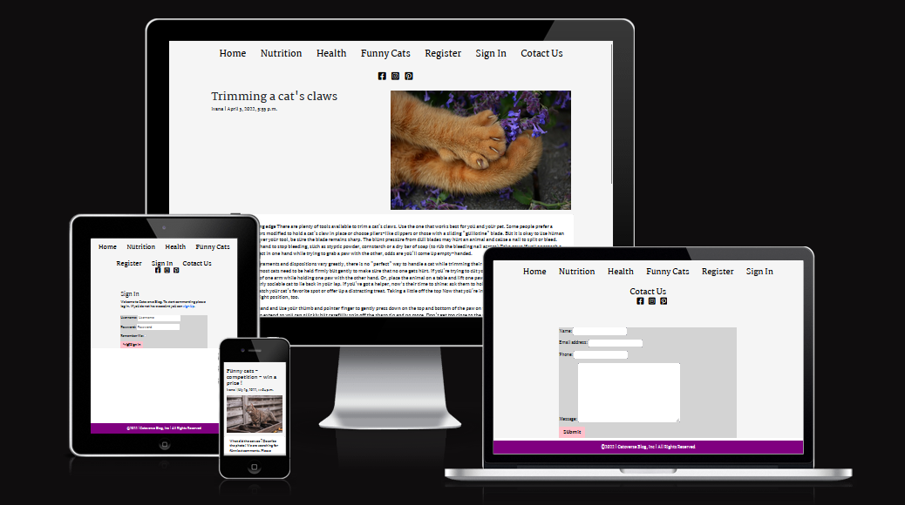

# User Experience
## User Stories

- User Stories are made with an Agile approach. 

  - As a User I want to see comment box so I can comment blog article.
  - As a User I want to see a heart symbol so that I can like the post.
  - As a User I want to see register or sign up button so that I can create my account to be able to comment blog articles.
  - As a User I want to see a delete button on a comments page so that I can delete my comment if I want.
  - As a User I want to see edit button so that I can edit my comment.
  - As a User I want to see more blog posts under one topic so I can learn more about cats.

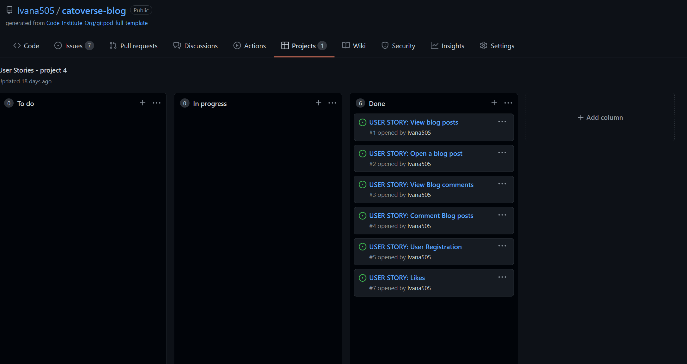

## Features
- Navigation and Social Media Icons
    - Navigation is set at the center of the page with options to choose : 
      "Home", "Nutrition", "Health", "Funny Cats", "Register" and "Sign In".

      - "Home" brings back User to the main page.
      - "Nutrition" and "Health" show blog content related to this topic.
      - "Funny Cats" is a page where User can comment funny images and be involved in a competition and Weekly prize draws.

- Navigation
 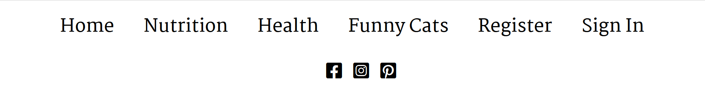

- Social Media Icons
 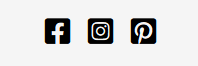

- Blog List and Blog Post
    - Blog post lists include a cat image with these details : Author's name, Title and main topic, date when the blog was posted and paw icon which shows how many "paws/likes" does each blog have.
    - Blog post includes a blog post with text about specific topic and under the text option to like or comment the page, only for the users who are registered.

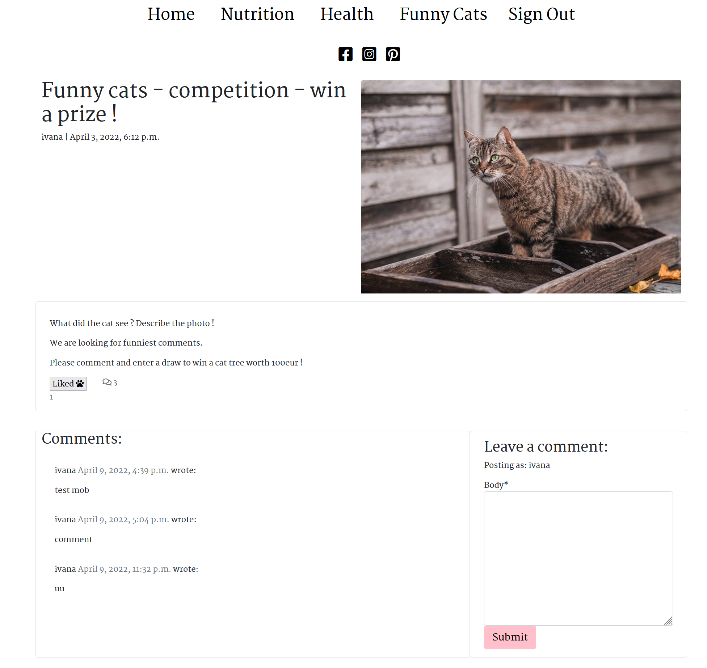

- Footer with Copyright sign, year when it was created and Blog name.

- Register and sign in link where the User can register and start commenting on the blog posts and "like" them.

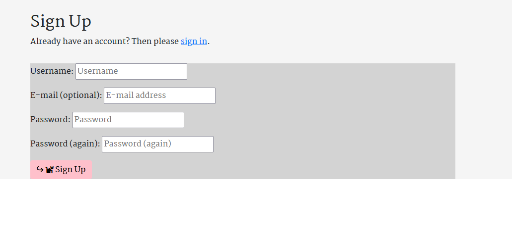

- Sign Out link where User can logout from the account.

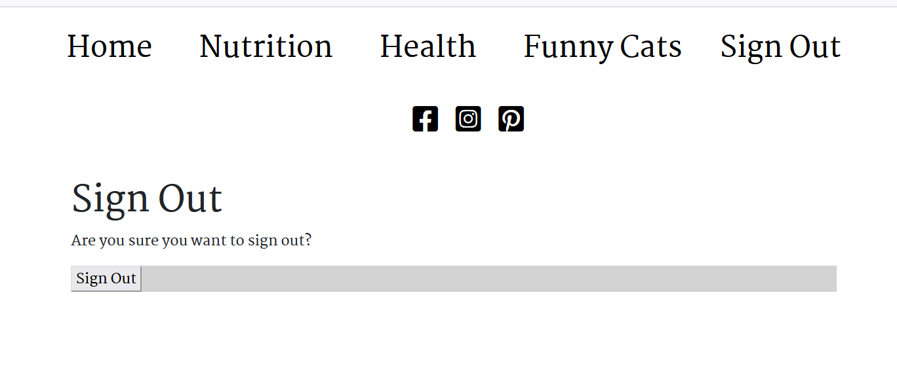

## Goals

### Visitor goals

The target audience are all the people who love cats and are interested in different topics related to cats.

- To view and find interesting blog posts about cats.
- To learn more about cats and their behaviour.
- To be able to register and comment blog posts.
- To like blog posts.
- To write about their experience with cats and to give advice.

### User Goals

As a user I would like to:

- Be able register and create account.
- Be able to comment blog posts.
- Be able to delete my posts.
- Be able to like posts.

## Design Choices

Font choices

I have decided to use [Google Fonts](https://fonts.google.com/). 
 - Font Style used: Monserat weight 600
 - This font complements Catoverse Blog very well
 - I have included example of the style below:  
    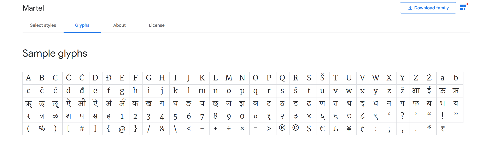

Icons

- Social Media Icons [Facebook](https://www.facebook.com/), [Instagram](https://www.instagram.com/) and [Pinterest](https://www.pinterest.ie/) are added on the top center of the page, under navigation links where user will be able to find further Information about Catoverse Blog. Social Media Accounts are not created but show that the user will be able to click on the icons and find further details about the website there in the future.
- [Fontawesome](https://fontawesome.com/) was used to add social media icons.

  - Paw and cat icons used 

  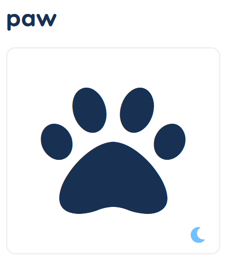

  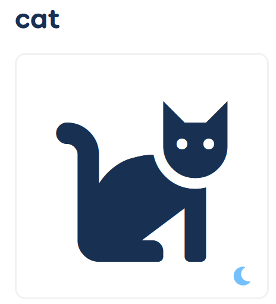

## Color scheme and styling

I have decided to use 5 colors in the project: 
 - white for the background and for the text color of the footer and black color for the text
 - purple is used as a background color for the footer
 - pink is used as a background color for the submit button
 - light gray is used as a background colot on the forms
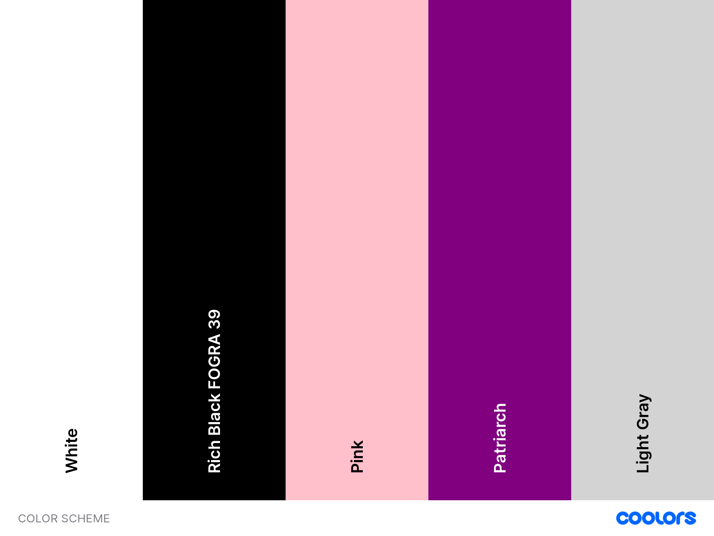

## Wireframes
All wireframes are created with [Balsamiq](https://balsamiq.com/) during the Scope Plane part of the design and planning process for this project.

Main Page
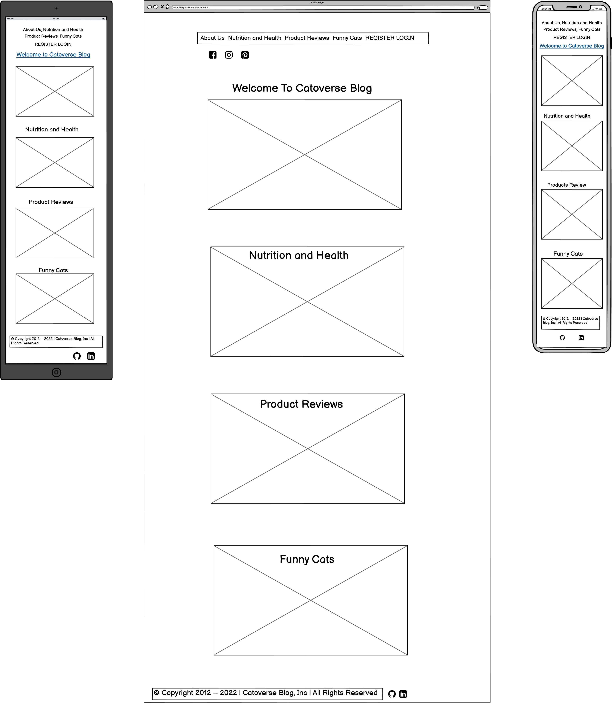

About Us
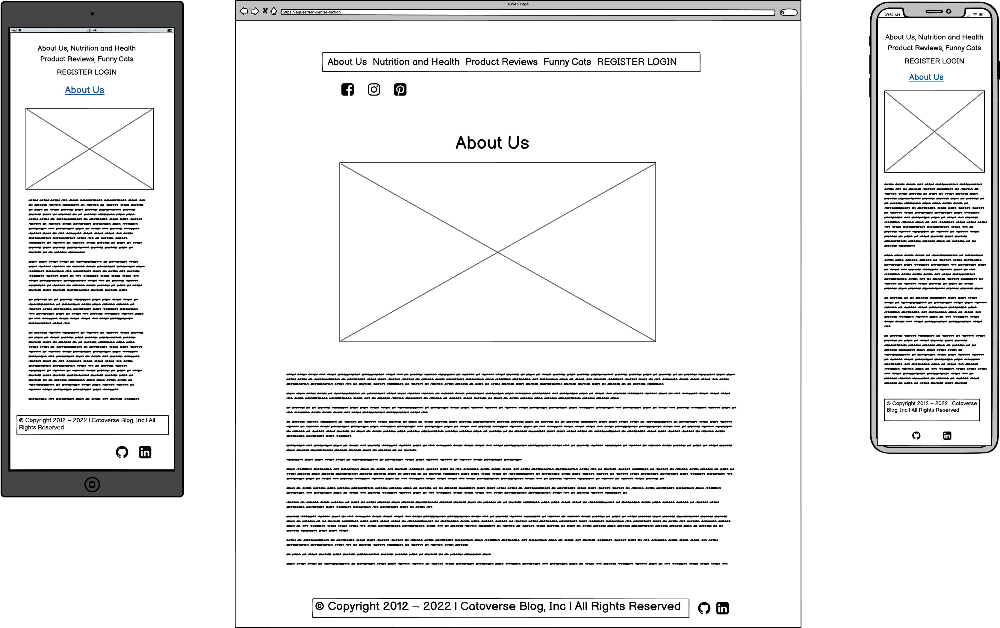

Nutrition and Health
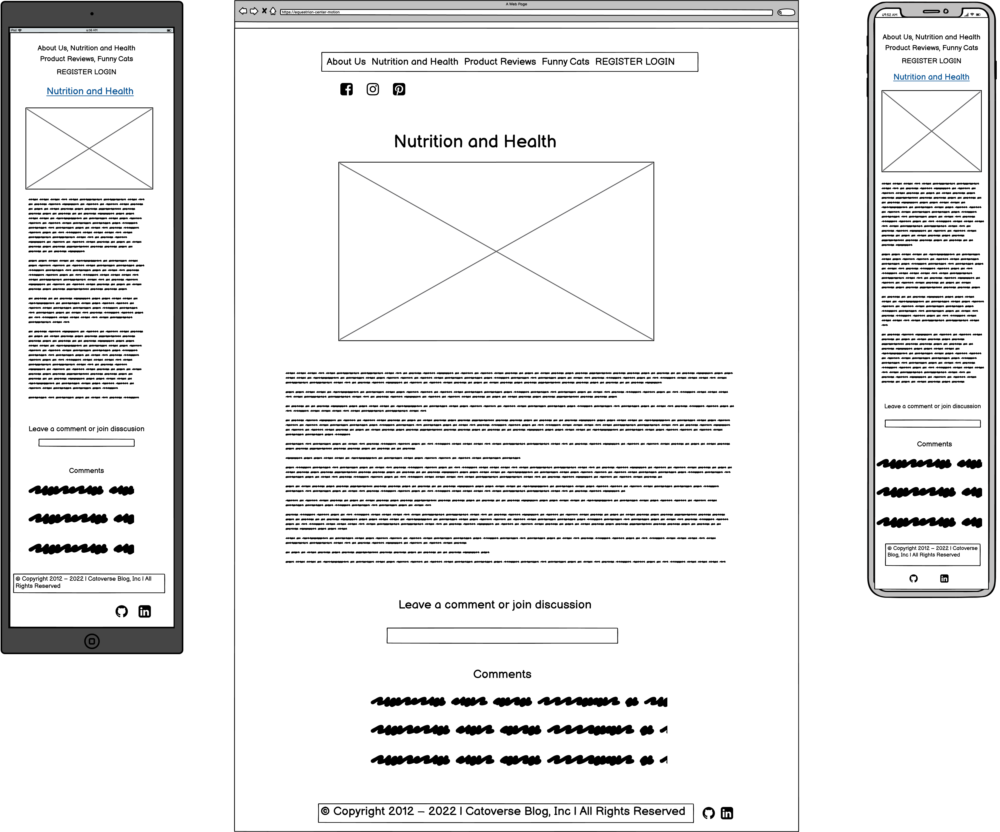

Product Review

Funny Cats
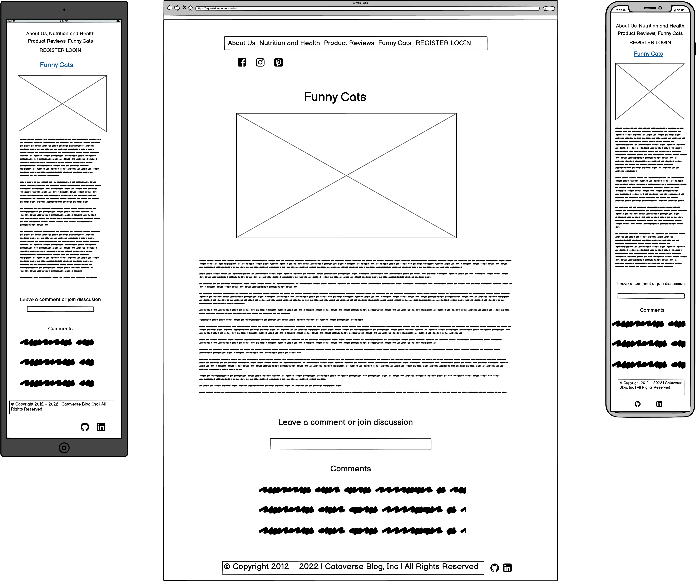

Register Page
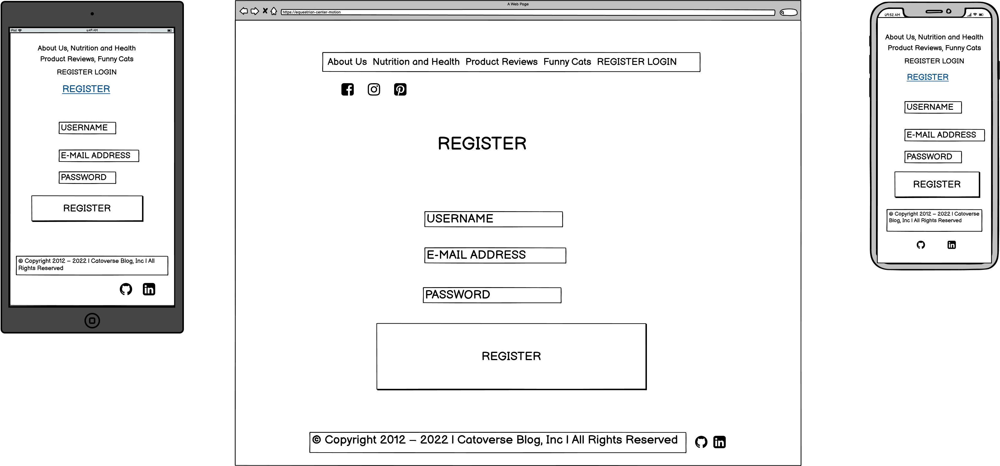

Sign In Page
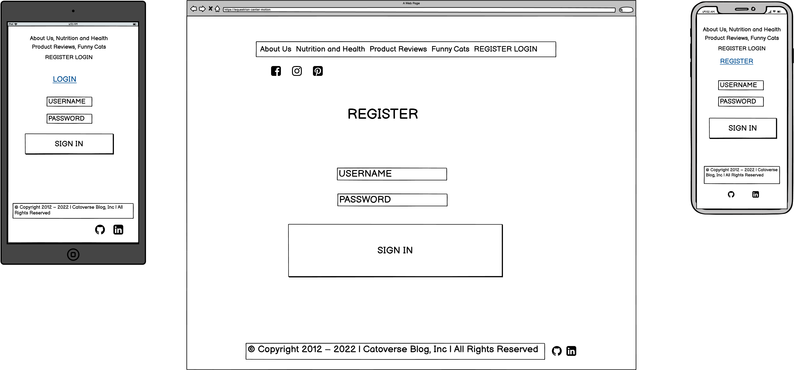

## Testings

To view all testing documentation please refer to [TESTING.md](TESTING.md)

### Local Deployment

In order to make a local copy of this repository, you can type the following into your IDE Terminal:

- `git clone https://github.com/Ivana505/catoverse-blog.git` 

Alternatively, if using Gitpod, you can click below to create your own workspace using this repository.

The site was deployed to [Heroku](https://catoverse-blog.herokuapp.com/) pages using following steps: 
   - Sign up or Login to Heroku 
   - Click on the "NEW APPLICATION" and create an App name and choose your region
   - Click on "Deploy" and choose your deployment method
   - If you are connecting with Github choose your main branch and find your repository
   - Add config vars PORT = 8000 and buildpacks python and nodejs
   - Click on deploy manually or automatically
   - The project has now been deployed
   - When deployed click on view
   - If you click on settings on the main menu bar you will find your Heroku git URL

    To install the required packages for this application, type the following: pip3 install -r requirements.txt

import pyfiglet
import random
import sys
import os
asgiref==3.5.0
backports.zoneinfo==0.2.1
cloudinary==1.29.0
dj-database-url==0.5.0
dj3-cloudinary-storage==0.0.6
Django==3.2
django-allauth==0.50.0
django-crispy-forms==1.14.0
django-summernote==0.8.20.0
gunicorn==20.1.0
oauthlib==3.2.0
psycopg2==2.9.3
psycopg2-binary==2.9.3
PyJWT==2.3.0
python3-openid==3.2.0
pytz==2022.1
requests-oauthlib==1.3.1
sqlparse==0.4.2

The live site can be previewed [here](https://catoverse-blog.herokuapp.com/).

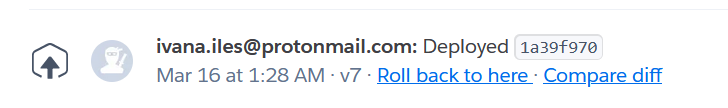

  # Languages and technologies used
- [Python](https://www.python.org/) - used for core programming language and logic
- [Github](https://github.com/) - used for securely storing the code online
- [Git](https://git-scm.com/) - used for version control
- [Gitpod](https://www.gitpod.io/) - used for online cloud IDE and development
- [Heroku](https://heroku.com/) - platform used to deploy game to cloud online
- [Django Secret Key Generator](https://miniwebtool.com/django-secret-key-generator/) - for generating Secret Key
- [Font Awesome](https://fontawesome.com/) - for Icons on the page
- [Freeformatter](https://www.freeformatter.com/) - used to format and beautify HTML and CSS code
- [PEP8 validator](http://pep8online.com/) - used to validate Python code
- [Coloors](https://coolors.co/) - to create color scheme for the UX section

## Credits and Acknowledgements

  Main credit for the code that helped me in this learning process and to create this project was Full Stack Frameworks (FST) videos: "Hello Django" and "I Think Therefore I Blog" by Code Institute.

  Image and Social Media sources:
- [YouTube channel ](https://www.youtube.com/)
- [Pixabay](https://pixabay.com/users/almi-205352/) - image by Andreas Almstedt
- [Pixabay](https://pixabay.com/users/naturell-10315240/?utm_source=link-attribution&amp;utm_medium=referral&amp;utm_campaign=image&amp;utm_content=5237869) - photo by Aline (Алевтина) Mueller
- [Pixabay](https://pixabay.com/users/miezekieze-607096/?utm_source=link-attribution&amp;utm_medium=referral&amp;utm_campaign=image&amp;utm_content=6934928S) - photo by miezekieze
- [Pixabay](https://pixabay.com/users/vistawei-915694/?utm_source=link-attribution&amp;utm_medium=referral&amp;utm_campaign=image&amp;utm_content=1092371) - photo by vistawei

  Other sources
  - [Katzenworld](https://katzenworld.co.uk/)
  - [The Purrington Post](https://www.thepurringtonpost.com/)
  - [The Fluffy Kitty](https://thefluffykitty.com/)
  - [The Catnip Times](https://www.thecatniptimes.com/)
  - [MDBootstrap](https://mdbootstrap.com/docs/standard/navigation/footer/) - for adding footer with bootstrap
  - [Get bootstrap](https://getbootstrap.com/docs/4.0/components/card/#header-and-footer) - to add footer to base.html by using cards
  - [Toptal](https://www.toptal.com/designers/htmlarrows/) - to look for HTML Symbols
  - [Wagwalking](https://wagwalking.com/cat/condition/obesity) - text for the obesity in cats blog post
  - [Humane Society](https://www.humanesociety.org/resources/trimming-cats-claws) - text for the trimming of cats claws
  - [Litter Robot](https://www.litter-robot.com/blog/heterochromia-cats-with-different-colored-eyes/) - text for heterochromia blog post
  - [Developer Mozilla](https://developer.mozilla.org/en-US/docs/Learn/Server-side/Django/Home_page) - for adding paths
  - [Pythonista Planet](https://pythonistaplanet.com/template-extending-in-django/) - for template extending in Django

I want to say thank you to my Mentor Tim for the guidance, tutor support and special thanks to the Code Institute Slack community.

### Content
 - Content was created intentionally for the purpose of this project and this Website.
