# TESTING 

Return to the [README.md](README.md)

## Validator testing and browser compatibility
- I have tested Python code with - [PEP8 validator](http://pep8online.com/), first testing showed errors.

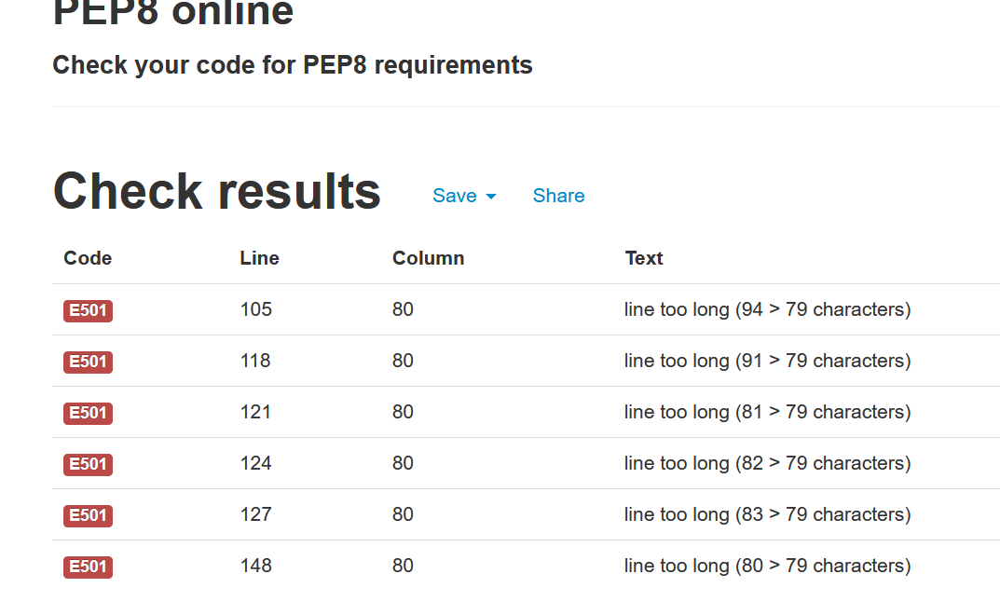

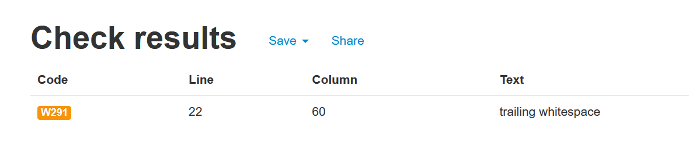

- All errors have been corrected

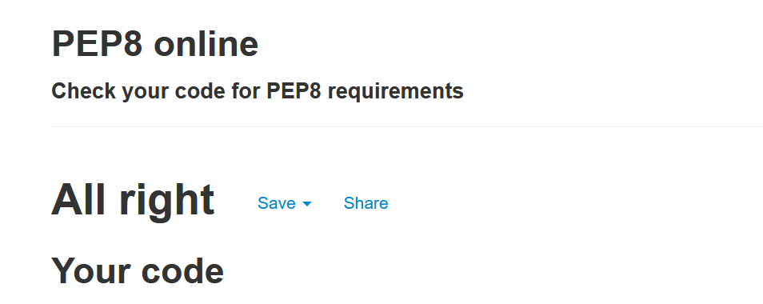

- HTML Validation was made with 

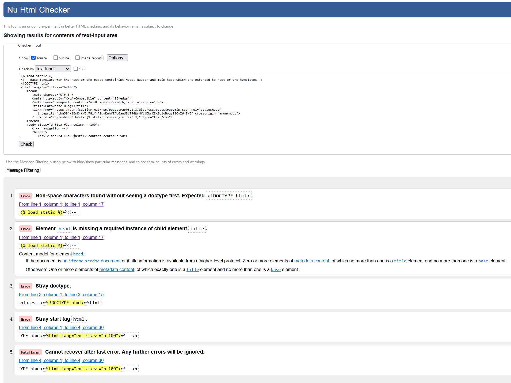
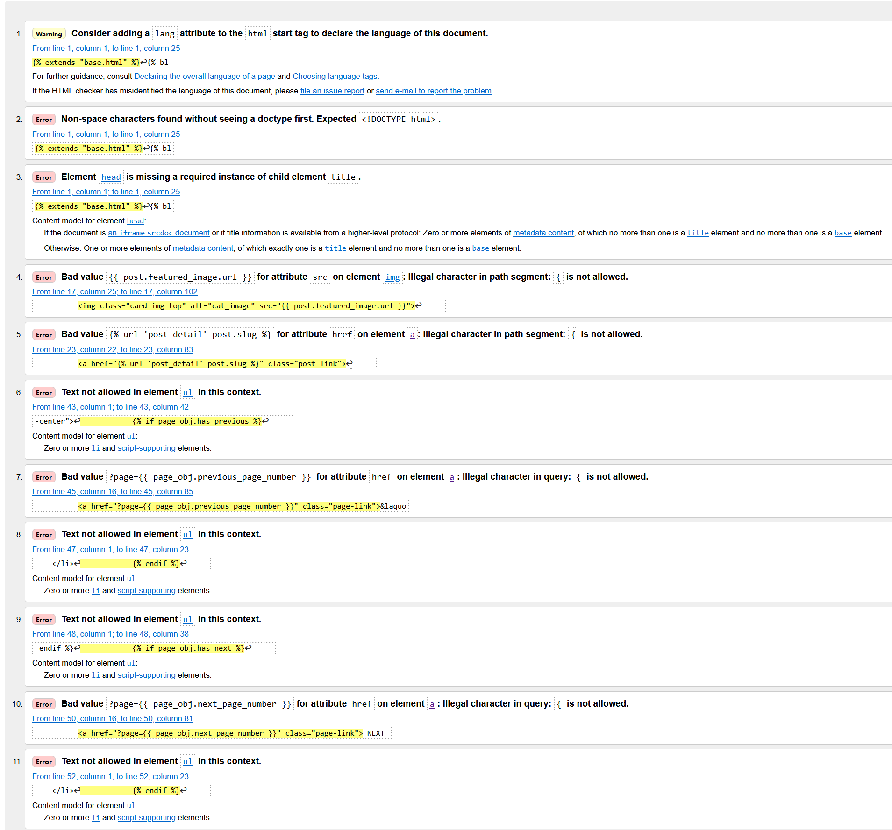
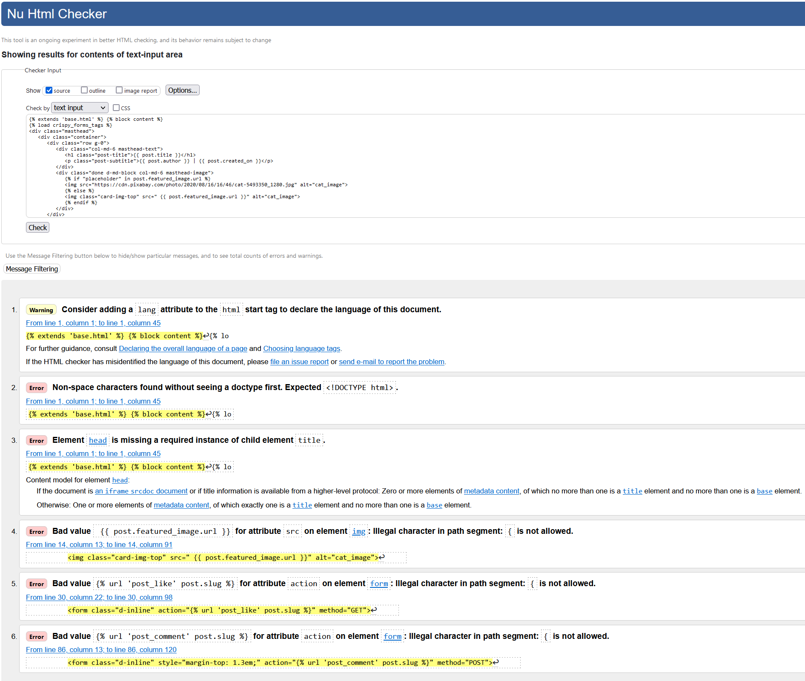

- CSS Validation was made with Jigsaw 

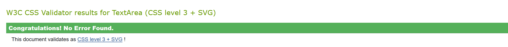

## Accessibility
- I have confirmed that the Website is accessible by inspecting it in Lighthouse on the [Google Chrome](https://www.google.com/chrome/?brand=FKPE&gclid=EAIaIQobChMIqOPWwuu69AIVFeDtCh1CEgKGEAAYASAAEgKvwvD_BwE&gclsrc=aw.ds) Dev tools.
    
Result for desktop 
 - Performance for the desktop version 

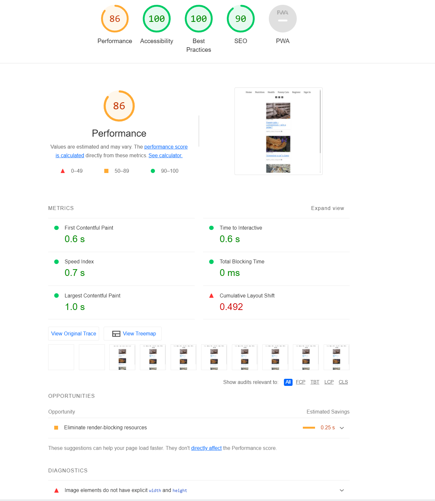

Result for mobile devices
- Performance for mobile devices 

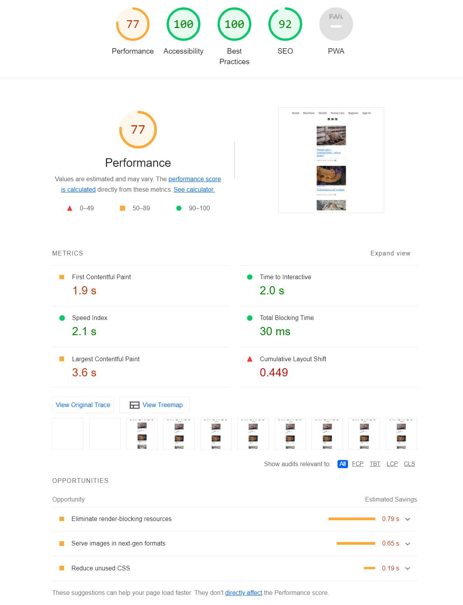

## Bugs

### Solved
- All problems from [Gitpod](https://www.gitpod.io/) from the image have been resolved. Most of them were indentation bugs and lines of code too long.

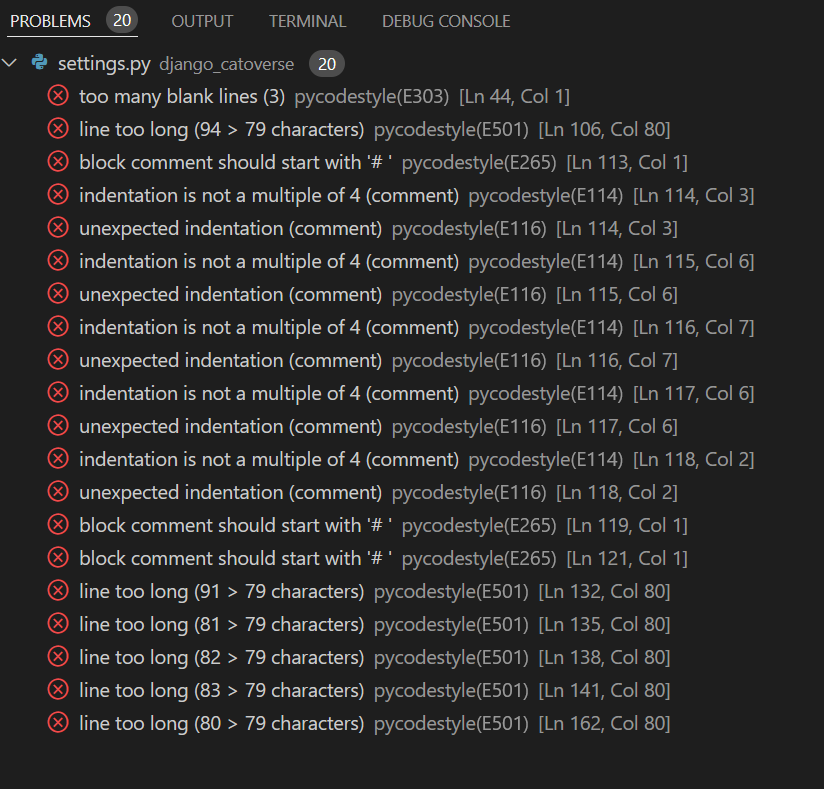

- Bad Request (400) on [Herokuapp](https://dashboard.heroku.com/) was resolved by adding CSRF.

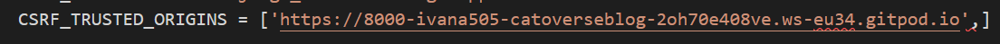

- Error "GET / HTTP/1.1" 500 98967 on [Gitpod](https://www.gitpod.io/) was resolved by moving file in the correct folder.

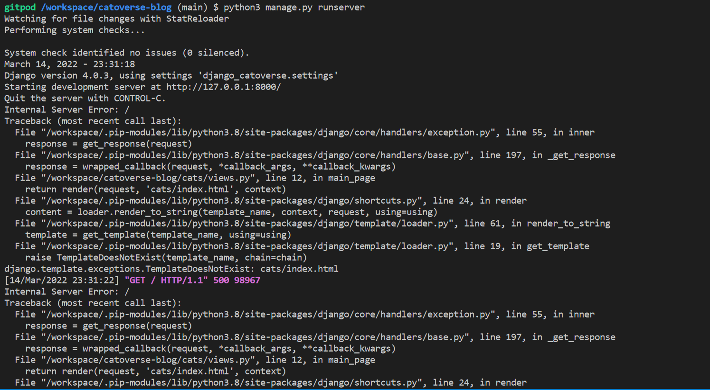

- Error Improperly Configured was resolved by adding space to settings.DATABASES.

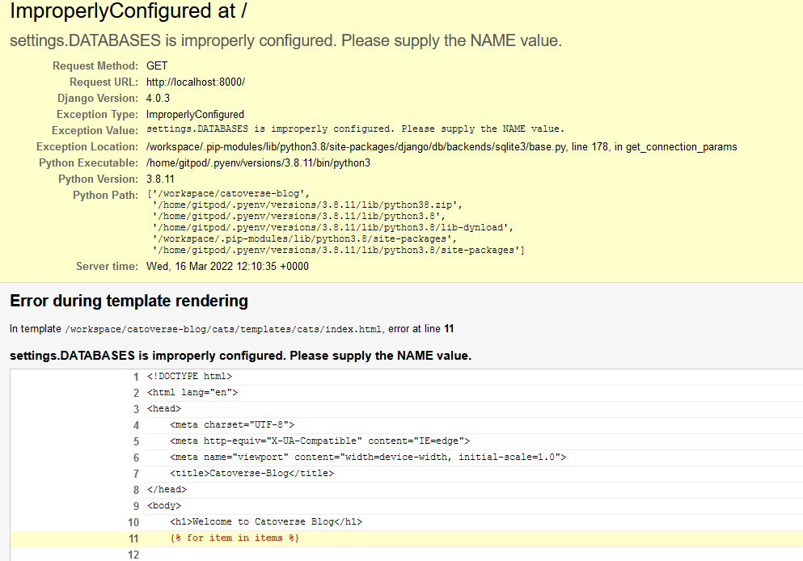

- Error Invalid Host Error was corrected by adding allowed host on settings.py.

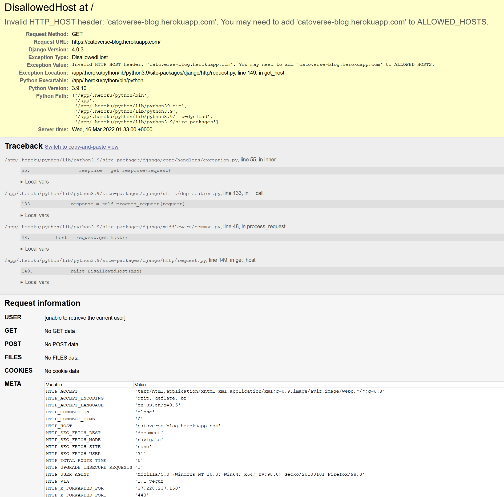

### Unsolved bugs
- Unsolved problem which relates to ms-toolsai.jupyter extension not bein synched and not added in .gitpod.yml. I have checked Slack community and this is known issue which we can ignore.
- This is also part of the repository cloned for the project that should not be touched.

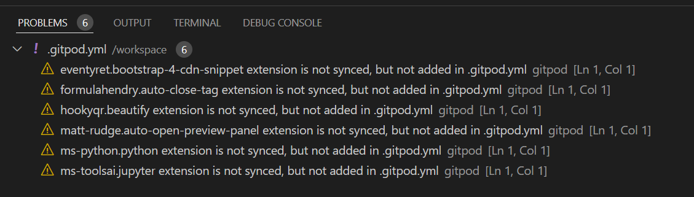

- Unsolved bugs which I could not resolve are the HTML validation errors 

